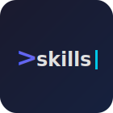
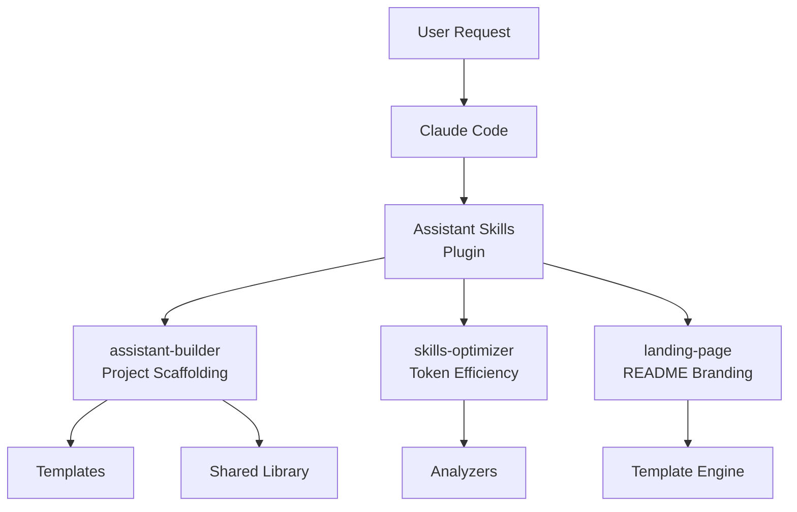

<p align="center">
  
</p>

<h1 align="center">Assistant Skills</h1>

<table align="center">
<tr>
<td align="center">
<h2>10x</h2>
<sub>Faster skill<br>development</sub>
</td>
<td align="center">
<h2>3</h2>
<sub>Production-ready<br>skills included</sub>
</td>
<td align="center">
<h2>20+</h2>
<sub>Scripts &<br>templates</sub>
</td>
<td align="center">
<h2>0</h2>
<sub>Boilerplate<br>to write</sub>
</td>
</tr>
</table>

<p align="center">
  <a href="https://github.com/grandcamel/Assistant-Skills"></a>
  
  
  
  
</p>

<p align="center">
  <strong>Build Claude Code skills in minutes, not days.</strong><br>
  <sub>Templates, wizards, and tools from production implementations.</sub>
</p>

<div align="center">

```
> "Create a new Datadog Assistant Skills project"

✓ Project scaffolded with best practices
✓ Shared library configured
✓ First skill template ready
✓ Test infrastructure in place
```

</div>

<p align="center">
  <a href="#quick-start"><strong>Get Started</strong></a> &bull;
  <a href="#included-skills">Skills</a> &bull;
  <a href="#who-is-this-for">Use Cases</a> &bull;
  <a href="#templates">Templates</a>
</p>

---

## The Difference

<table>
<tr>
<td width="50%">

### Starting from Scratch
```
1. Research skill structure
2. Figure out SKILL.md format
3. Write boilerplate code
4. Set up test infrastructure
5. Create documentation
6. Debug token efficiency issues
```
*Hours of trial and error...*

</td>
<td width="50%">

### With Assistant Skills
```
"Create a new GitHub Assistant Skills project
with search and issues skills"
```
*Production-ready in minutes.*

</td>
</tr>
</table>

### Time Saved

| Task | From Scratch | With This Toolkit | Saved |
|------|--------------|-------------------|-------|
| New project setup | 2-4 hours | 5 minutes | 95% |
| Add new skill | 30-60 min | 2 minutes | 95% |
| Optimize for tokens | 1-2 hours | 1 minute | 98% |
| Create landing page | 2-3 hours | 10 minutes | 90% |

---

## Quick Start

### 1. Install Plugin

From Claude Code:
```
/plugin grandcamel/Assistant-Skills
```

This adds the marketplace and installs the `assistant-skills` plugin with all 3 skills.

**Alternative: Clone locally**
```bash
git clone https://github.com/grandcamel/Assistant-Skills.git
cd Assistant-Skills && /plugin .
```

### 2. Create Your First Project

```
"Create a new Slack Assistant Skills project"
```

Or use the interactive wizard:
```
/assistant-builder-setup
```

### 3. Start Building

Claude scaffolds your project with:
- Optimized directory structure
- Shared library with HTTP client, error handling
- First skill template ready to customize
- Test infrastructure configured

**That's it.** Start building your skills immediately.

---

## Included Skills

| Skill | Purpose | Example |
|-------|---------|---------|
| **assistant-builder** | Create & extend projects | `"Add a search skill to my project"` |
| **skills-optimizer** | Audit token efficiency | `"Analyze my skill for optimization"` |
| **landing-page** | Generate branded READMEs | `"Create a landing page for this project"` |

### assistant-builder

Interactive wizard for creating new Assistant Skills projects or adding skills to existing ones.

```bash
# Create new project
python skills/assistant-builder/scripts/scaffold_project.py

# Add skill to existing project
python skills/assistant-builder/scripts/add_skill.py --name "search"

# Validate project structure
python skills/assistant-builder/scripts/validate_project.py /path/to/project
```

### skills-optimizer

Audit skills for token efficiency and progressive disclosure compliance.

```bash
# Analyze a skill (get grade A-F)
./skills/skills-optimizer/scripts/analyze-skill.sh ~/.claude/skills/my-skill

# Audit all skills
./skills/skills-optimizer/scripts/audit-all-skills.sh ~/.claude/skills
```

### landing-page

Generate professional README landing pages with consistent branding.

```bash
# Analyze project metadata
python skills/landing-page/scripts/analyze_project.py /path/to/project

# Generate logo SVG
python skills/landing-page/scripts/generate_logo.py --name jira --primary "#0052CC"
```

---

## Who Is This For?

<details>
<summary><strong>Developers building Claude Code integrations</strong></summary>

- Skip the boilerplate—start with production patterns
- Follow proven architecture from 40+ skill implementations
- Get token-efficient skills that don't bloat context
- Use TDD workflow with test templates included

</details>

<details>
<summary><strong>Teams standardizing on Claude Code</strong></summary>

- Consistent skill structure across projects
- Shared library patterns for common functionality
- Documentation templates for team onboarding
- Quality gates with optimization scoring

</details>

<details>
<summary><strong>Open source maintainers</strong></summary>

- Professional landing pages in minutes
- Branded logos with terminal prompt design
- Consistent visual identity across repos
- Badge and stats automation

</details>

---

## Templates

Comprehensive templates derived from production implementations:

| Folder | Purpose |
|--------|---------|
| `00-project-lifecycle/` | API research, GAP analysis, architecture planning |
| `01-project-scaffolding/` | Project initialization, directory structure, configs |
| `02-shared-library/` | HTTP client, error handling, auth patterns |
| `03-skill-templates/` | SKILL.md format, script templates, validators |
| `04-testing/` | TDD workflow, pytest fixtures, test patterns |
| `05-documentation/` | Workflow guides, reference docs, examples |
| `06-git-and-ci/` | Commit conventions, GitHub Actions, releases |

---

## Shared Library

Production-ready Python modules in `skills/shared/scripts/lib/`:

| Module | Purpose |
|--------|---------|
| `formatters.py` | Output formatting (tables, trees, colors, timestamps) |
| `validators.py` | Input validation (emails, URLs, dates, pagination) |
| `template_engine.py` | Template loading and placeholder replacement |
| `project_detector.py` | Find existing Assistant Skills projects |
| `cache.py` | Response caching with TTL and LRU eviction |
| `error_handler.py` | Exception hierarchy and `@handle_errors` decorator |

```python
# Example usage
from formatters import format_table, format_tree
from validators import validate_email, validate_url
from cache import cached
from error_handler import handle_errors

@handle_errors
@cached(ttl=300)
def fetch_data(resource_id):
    return api.get(f"/resources/{resource_id}")
```

---

## Architecture



### Progressive Disclosure Model

Skills use 3 levels to minimize token usage:

| Level | Target | Loaded When |
|-------|--------|-------------|
| L1: Metadata | ~200 chars | Startup (all skills) |
| L2: SKILL.md | <500 lines | Skill triggered |
| L3: Nested docs | Variable | Explicitly accessed |

---

## Reference Projects

Templates derived from production implementations:

| Project | Skills | Tests | Status |
|---------|--------|-------|--------|
| Jira-Assistant-Skills | 14 | 560+ | Production |
| Confluence-Assistant-Skills | 14 | 200+ | Production |
| Splunk-Assistant-Skills | 13 | 150+ | Production |

---

## Development

### Run Tests

```bash
PYTHONPATH="skills/shared/scripts/lib" pytest skills/assistant-builder/tests/ -v
```

### Project Structure

```
Assistant-Skills/
├── .claude-plugin/
│   ├── plugin.json           # Plugin manifest
│   └── marketplace.json      # Marketplace registry
├── skills/
│   ├── assistant-builder/    # Project scaffolding
│   ├── skills-optimizer/     # Token optimization
│   ├── landing-page/         # README branding
│   └── shared/scripts/lib/   # Shared library
│       ├── formatters.py
│       ├── validators.py
│       ├── cache.py
│       └── error_handler.py
├── 00-project-lifecycle/     # Templates
├── 01-project-scaffolding/
├── 02-shared-library/
├── ...
└── README.md
```

---

## Contributing

Contributions welcome!

```bash
# Clone the repository
git clone https://github.com/grandcamel/Assistant-Skills.git
cd Assistant-Skills

# Run tests
PYTHONPATH="skills/shared/scripts/lib" pytest skills/*/tests/ -v
```

---

## License

MIT License — see [LICENSE](LICENSE) for details.

---

<p align="center">
  <strong>Stop writing boilerplate. Start building skills.</strong>
  <br>
  <sub>Built for Claude Code by developers who got tired of reinventing the wheel.</sub>
</p>
