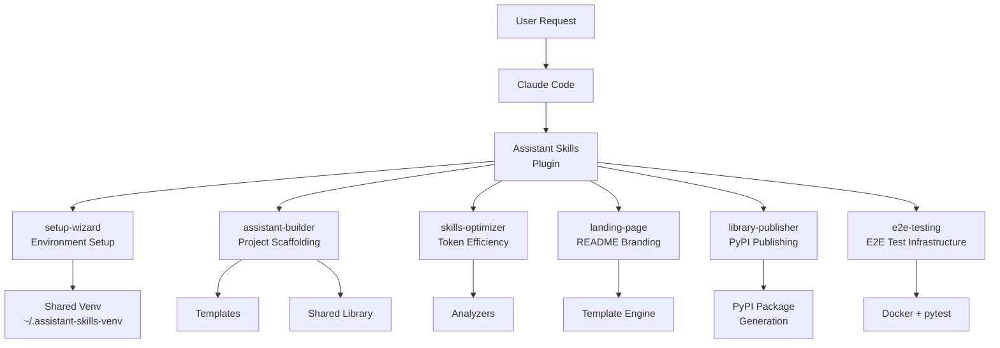

<p align="center">
  
</p>

<h1 align="center">Assistant Skills</h1>

<table align="center">
<tr>
<td align="center">
<h2>10x</h2>
<sub>Faster skill<br>development</sub>
</td>
<td align="center">
<h2>6</h2>
<sub>Production-ready<br>skills included</sub>
</td>
<td align="center">
<h2>20+</h2>
<sub>Scripts &<br>templates</sub>
</td>
<td align="center">
<h2>0</h2>
<sub>Boilerplate<br>to write</sub>
</td>
</tr>
</table>

<p align="center">
  <a href="https://github.com/grandcamel/Assistant-Skills"></a>
  <a href="https://pypi.org/project/assistant-skills-lib/"></a>
  
  
  
  
  <a href="https://github.com/grandcamel/Assistant-Skills/pkgs/container/assistant-skills"></a>
  
</p>

<p align="center">
  <strong>Build Claude Code skills in minutes, not days.</strong><br>
  <sub>Templates, wizards, and tools from production implementations.</sub>
</p>

<div align="center">

```
> "Create a new Datadog Assistant Skills project"

✓ Project scaffolded with best practices
✓ Shared library configured
✓ First skill template ready
✓ Test infrastructure in place
```

</div>

<p align="center">
  <a href="#quick-start"><strong>Get Started</strong></a> &bull;
  <a href="#included-skills">Skills</a> &bull;
  <a href="#who-is-this-for">Use Cases</a> &bull;
  <a href="#templates">Templates</a>
</p>

---

## The Difference

<table>
<tr>
<td width="50%">

### Starting from Scratch
```
1. Research skill structure
2. Figure out SKILL.md format
3. Write boilerplate code
4. Set up test infrastructure
5. Create documentation
6. Debug token efficiency issues
```
*Hours of trial and error...*

</td>
<td width="50%">

### With Assistant Skills
```
"Create a new GitHub Assistant Skills project
with search and issues skills"
```
*Production-ready in minutes.*

</td>
</tr>
</table>

### Time Saved

| Task | From Scratch | With This Toolkit | Saved |
|------|--------------|-------------------|-------|
| New project setup | 2-4 hours | 5 minutes | 95% |
| Add new skill | 30-60 min | 2 minutes | 95% |
| Optimize for tokens | 1-2 hours | 1 minute | 98% |
| Create landing page | 2-3 hours | 10 minutes | 90% |

---

## Quick Start

### 1. Install Plugin

From Claude Code:
```
/plugin grandcamel/Assistant-Skills
```

This adds the marketplace and installs the `assistant-skills` plugin with all 6 skills.

**Alternative: Clone locally**
```bash
git clone https://github.com/grandcamel/Assistant-Skills.git
cd Assistant-Skills && /plugin .
```

### 2. Set Up Environment

Run the setup wizard to configure the shared Python environment:
```
/assistant-skills-setup
```

The wizard will:
- Create a shared venv at `~/.assistant-skills-venv/`
- Install Python dependencies
- Add the `claude-as` shell function to your `.bashrc`/`.zshrc`

After setup, use `claude-as` instead of `claude` to run with dependencies:
```bash
claude-as  # Runs Claude with Assistant Skills venv
```

### Alternative: Docker

Run Claude Code with Assistant Skills in a container—no local Python setup required:

```bash
# Using the helper script
./scripts/claude-as-docker.sh

# Or directly with Docker
docker run -it --rm \
  -e ANTHROPIC_API_KEY=$ANTHROPIC_API_KEY \
  -v $(pwd):/workspace \
  -v ~/.claude:/home/claude/.claude \
  ghcr.io/grandcamel/assistant-skills:latest
```

Install additional plugins or marketplaces:
```bash
# Install extra plugins
CLAUDE_PLUGINS="owner/plugin1,owner/plugin2" ./scripts/claude-as-docker.sh

# Install from multiple marketplaces
CLAUDE_MARKETPLACES="grandcamel/Assistant-Skills,other/marketplace" ./scripts/claude-as-docker.sh
```

See [Docker Usage](#docker-usage) for more options.

### 3. Create Your First Project

```
"Create a new Slack Assistant Skills project"
```

Or use the interactive wizard:
```
/assistant-builder-setup
```

### 4. Start Building

Claude scaffolds your project with:
- Optimized directory structure
- Shared library with HTTP client, error handling
- First skill template ready to customize
- Test infrastructure configured

**That's it.** Start building your skills immediately.

---

## Included Skills

| Skill | Purpose | Example |
|-------|---------|---------|
| **setup-wizard** | Configure shared venv & shell | `/assistant-skills-setup` |
| **assistant-builder** | Create & extend projects | `"Add a search skill to my project"` |
| **skills-optimizer** | Audit token efficiency | `"Analyze my skill for optimization"` |
| **landing-page** | Generate branded READMEs | `"Create a landing page for this project"` |
| **library-publisher** | Publish shared libs to PyPI | `"Publish my shared library as a PyPI package"` |
| **e2e-testing** | Set up E2E test infrastructure | `"Add E2E tests to my plugin"` |

### setup-wizard

Configure the shared Python environment for all Assistant Skills plugins.

```bash
# Run the interactive setup wizard
/assistant-skills-setup

# After setup, use claude-as to run with dependencies
claude-as
```

Creates `~/.assistant-skills-venv/` (shared venv) and adds `claude-as` function to shell.

### assistant-builder

Interactive wizard for creating new Assistant Skills projects or adding skills to existing ones.

```bash
# Create new project
python skills/assistant-builder/scripts/scaffold_project.py

# Add skill to existing project
python skills/assistant-builder/scripts/add_skill.py --name "search"

# Validate project structure
python skills/assistant-builder/scripts/validate_project.py /path/to/project
```

### skills-optimizer

Audit skills for token efficiency and progressive disclosure compliance.

```bash
# Analyze a skill (get grade A-F)
./skills/skills-optimizer/scripts/analyze-skill.sh ~/.claude/skills/my-skill

# Audit all skills
./skills/skills-optimizer/scripts/audit-all-skills.sh ~/.claude/skills
```

### landing-page

Generate professional README landing pages with consistent branding.

```bash
# Analyze project metadata
python skills/landing-page/scripts/analyze_project.py /path/to/project

# Generate logo SVG
python skills/landing-page/scripts/generate_logo.py --name jira --primary "#0052CC"
```

### library-publisher

Extract shared libraries and publish them as PyPI packages with automated CI/CD.

```bash
# Analyze existing shared library
python skills/library-publisher/scripts/analyze_library.py /path/to/project

# Scaffold PyPI package
python skills/library-publisher/scripts/scaffold_package.py \
  --name "myproject-lib" \
  --source /path/to/lib \
  --output ~/myproject-lib

# Migrate project to use new package
python skills/library-publisher/scripts/migrate_imports.py \
  --project /path/to/project \
  --package myproject_lib
```

### e2e-testing

Set up end-to-end testing infrastructure for Claude Code plugins.

```bash
# Initialize E2E testing infrastructure
python skills/e2e-testing/scripts/setup_e2e.py /path/to/project

# Auto-generate test cases from plugin structure
python skills/e2e-testing/scripts/generate_test_cases.py /path/to/project

# Run tests
./scripts/run-e2e-tests.sh

# Update documentation with E2E info
python skills/e2e-testing/scripts/update_docs.py /path/to/project
```

---

## Who Is This For?

<details>
<summary><strong>Developers building Claude Code integrations</strong></summary>

- Skip the boilerplate—start with production patterns
- Follow proven architecture from 40+ skill implementations
- Get token-efficient skills that don't bloat context
- Use TDD workflow with test templates included

</details>

<details>
<summary><strong>Teams standardizing on Claude Code</strong></summary>

- Consistent skill structure across projects
- Shared library patterns for common functionality
- Documentation templates for team onboarding
- Quality gates with optimization scoring

</details>

<details>
<summary><strong>Open source maintainers</strong></summary>

- Professional landing pages in minutes
- Branded logos with terminal prompt design
- Consistent visual identity across repos
- Badge and stats automation

</details>

---

## Templates

Comprehensive templates derived from production implementations:

| Folder | Purpose |
|--------|---------|
| `templates/00-project-lifecycle/` | API research, GAP analysis, architecture planning |
| `templates/01-project-scaffolding/` | Project initialization, directory structure, configs |
| `templates/02-shared-library/` | HTTP client, error handling, auth patterns |
| `templates/03-skill-templates/` | SKILL.md format, script templates, validators |
| `templates/04-testing/` | TDD workflow, pytest fixtures, test patterns |
| `templates/05-documentation/` | Workflow guides, reference docs, examples |
| `templates/06-git-and-ci/` | Commit conventions, GitHub Actions, releases |

---

## Shared Library

Production-ready Python utilities available via PyPI:

```bash
pip install assistant-skills-lib
```

| Module | Purpose |
|--------|---------|
| `formatters` | Output formatting (tables, trees, colors, timestamps) |
| `validators` | Input validation (emails, URLs, dates, pagination) |
| `template_engine` | Template loading and placeholder replacement |
| `project_detector` | Find existing Assistant Skills projects |
| `cache` | Response caching with TTL and LRU eviction |
| `error_handler` | Exception hierarchy and `@handle_errors` decorator |

```python
from assistant_skills_lib import (
    format_table, format_tree,
    validate_email, validate_url,
    Cache, handle_errors
)

@handle_errors
def fetch_data(resource_id):
    return api.get(f"/resources/{resource_id}")
```

📦 [assistant-skills-lib on PyPI](https://pypi.org/project/assistant-skills-lib/)

---

## Architecture



### Progressive Disclosure Model

Skills use 3 levels to minimize token usage:

| Level | Target | Loaded When |
|-------|--------|-------------|
| L1: Metadata | ~200 chars | Startup (all skills) |
| L2: SKILL.md | <500 lines | Skill triggered |
| L3: Nested docs | Variable | Explicitly accessed |

---

## Reference Projects

Templates derived from production implementations:

| Project | Skills | Tests | Status |
|---------|--------|-------|--------|
| [Jira-Assistant-Skills](https://github.com/grandcamel/Jira-Assistant-Skills) | 14 | 560+ | Production |
| [Confluence-Assistant-Skills](https://github.com/grandcamel/Confluence-Assistant-Skills) | 14 | 1,039 | Production |
| [Splunk-Assistant-Skills](https://github.com/grandcamel/Splunk-Assistant-Skills) | 13 | 248+ | Production |

---

## Development

### Run Tests

```bash
pip install -r requirements.txt
pytest skills/assistant-builder/tests/ -v
```

### Run E2E Tests

E2E tests validate the plugin by interacting with the actual Claude Code CLI:

```bash
# Requires ANTHROPIC_API_KEY
./scripts/run-e2e-tests.sh           # Run in Docker
./scripts/run-e2e-tests.sh --local   # Run locally
```

Failed test responses are logged to `test-results/e2e/responses_latest.log`.

See [tests/e2e/README.md](tests/e2e/README.md) for details.

### Project Structure

```
Assistant-Skills/
├── .claude-plugin/
│   ├── plugin.json           # Plugin manifest
│   ├── marketplace.json      # Marketplace registry
│   ├── commands/             # Slash commands
│   │   ├── assistant-skills-setup.md
│   │   └── assistant-builder-setup.md
│   └── agents/               # Skill reviewer agents
├── skills/
│   ├── setup-wizard/         # Environment setup
│   ├── assistant-builder/    # Project scaffolding
│   ├── skills-optimizer/     # Token optimization
│   ├── landing-page/         # README branding
│   ├── library-publisher/    # PyPI publishing
│   └── e2e-testing/          # E2E test infrastructure
├── hooks/                    # Plugin hooks
│   └── hooks.json            # SessionStart health checks
├── docker/                   # Docker infrastructure
│   ├── runtime/              # Claude Code runtime image
│   └── e2e/                  # E2E test image
├── .github/workflows/        # GitHub Actions
│   └── docker-publish.yml    # Publish image on release
├── templates/                # Project templates
│   ├── 00-project-lifecycle/
│   ├── 01-project-scaffolding/
│   └── ...
├── requirements.txt          # Python dependencies
└── README.md
```

---

## Docker Usage

Run Claude Code with Assistant Skills in a Docker container. No local Python or Node.js installation required.

### Quick Start

```bash
# Pull and run (API key authentication)
export ANTHROPIC_API_KEY=sk-ant-...
./scripts/claude-as-docker.sh

# Or use OAuth (mount existing credentials)
./scripts/claude-as-docker.sh --oauth
```

### Environment Variables

| Variable | Description |
|----------|-------------|
| `ANTHROPIC_API_KEY` | API key for Claude authentication |
| `CLAUDE_PLUGINS` | Comma-separated plugin repos (`owner/repo` or full URLs) |
| `CLAUDE_MARKETPLACES` | Comma-separated marketplace repos |
| `CLAUDE_REFRESH_PLUGINS` | Set to `false` to skip plugin updates (default: `true`) |

### Examples

```bash
# Run with a prompt
./scripts/claude-as-docker.sh -- -p "Help me refactor this code"

# Install additional plugins
CLAUDE_PLUGINS="myorg/my-plugin,other/plugin" ./scripts/claude-as-docker.sh

# Use multiple marketplaces
CLAUDE_MARKETPLACES="grandcamel/Assistant-Skills,company/internal-skills" \
  ./scripts/claude-as-docker.sh

# Skip plugin updates for faster startup
./scripts/claude-as-docker.sh --no-refresh

# Start a shell for debugging
./scripts/claude-as-docker.sh --shell

# Pull latest image before running
./scripts/claude-as-docker.sh --pull
```

### Building Locally

```bash
# Build the image
docker build -t assistant-skills -f docker/runtime/Dockerfile .

# Run with custom image
./scripts/claude-as-docker.sh --image assistant-skills
```

---

## Contributing

Contributions welcome!

```bash
# Clone the repository
git clone https://github.com/grandcamel/Assistant-Skills.git
cd Assistant-Skills

# Install dependencies and run tests
pip install -r requirements.txt
pytest skills/*/tests/ -v
```

---

## License

MIT License — see [LICENSE](LICENSE) for details.

---

<p align="center">
  <strong>Stop writing boilerplate. Start building skills.</strong>
  <br>
  <sub>Built for Claude Code by developers who got tired of reinventing the wheel.</sub>
</p>
